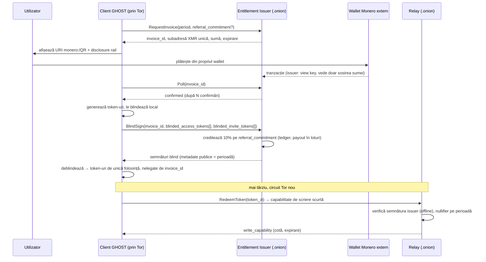

# GHOST — Master Plan v2.1 (propunere optimizată)

| Câmp | Valoare |
|---|---|
| Status | PROPUNERE — delta peste *GHOST Technical Specification v2.0 FINAL* (20 aug 2026) |
| Data | 10 septembrie 2026 |
| Bază | Spec v2.0 (`output/pdf/GHOST_Technical_Specification_v2_FINAL.pdf`) + audit complet al codului din `D:\Forum` |
| Obiectiv | Aplicație privată din toate punctele de vedere verificabile: conținut, identitate, IP, plată, metadate, dispozitiv, distribuție |
| Regulă | Nu se implementează nimic până la aprobarea ADR-urilor din §3. Acest document schimbă **traseul** și **câteva decizii de arhitectură**; principiile CP-01…CP-10 din spec rămân și sunt întărite |

---

## 0. Rezumat executiv

Specificația v2.0 este un document bun: a eliminat deja criptografia custom, derivarea cheilor din semnături Ethereum și promisiunile nerealiste din v1. Codul existent, în schimb, **nu are nicio legătură cu acea specificație**: ambele prototipuri (`app/` și `ghost-forum/`) sunt simulări cu criptografie falsă, nu compilează și încalcă direct cerințele P0. Scheletul `ghost/` (monorepo-ul canonic din Appendix B) este gol.

Din perspectiva „100% privat”, planul v2.0 mai are **patru goluri structurale** care nu se rezolvă prin implementare atentă, ci prin decizii de arhitectură:

1. **Anonimatul la nivel de rețea** se bazează pe un onion routing propriu cu 2–3 hop-uri peste 3–5 relay-uri ale operatorului. Setul de anonimat este minuscul și operatorul vede IP-ul clientului la primul hop. → **Tor (Arti) + relay-uri ca onion services**, fără clearnet.
2. **Plata** folosește USDC pe Base ca rail P0: adresa portofelului este publică pe blockchain, on-ramp-ul implică KYC, iar clientul vorbește cu un RPC blockchain. → **Monero + credențiale anonime blind-signed** (RFC 9474 / Privacy Pass RFC 9578); **fără blockchain, contracte, circuite ZK sau portofel integrat în P0**.
3. **O singură identitate în toate canalele** permite membrilor să coreleze participarea unui utilizator între canale. → **pseudonim derivat per canal**, identitatea de bază doar pentru DM și invite (dezvăluire opt-in).
4. **Endpoint și distribuție**: lipsesc cerințe pentru eliminarea metadatelor media (GPS/EXIF), interzicerea GMS/FCM și a SDK-urilor terțe, open-source cu build reproductibil. → adăugate ca P0.

Efectul asupra traseului: dispar fazele 10 (onion custom), 11 (wallet + contracte) și 12 (ZK) din v2.0 — între 16 și 26 de săptămâni de muncă și două domenii întregi de audit extern (Solidity, circuite). Sunt înlocuite cu integrarea Tor (2–4 s) și un emitent de credențiale blind (3–5 s). Estimarea de calendar scade de la 10–12 luni la **8–10 luni** cu o echipă de 5–6 persoane, cu o suprafață de atac mai mică și garanții de confidențialitate mai puternice.

Ce nu se poate garanta în niciun plan, și trebuie spus explicit (§7): un dispozitiv compromis, un adversar global pasiv la nivel de rețea, un membru de grup rău-intenționat, sau faptul că ISP-ul vede că folosești Tor.

---

## 1. Auditul proiectului (starea reală față de plan)

### 1.1 Inventar

| Cale | Ce este | Verdict |
|---|---|---|
| `app/` (pachet `com.ghostforum`, Gradle Groovy, AGP 8.0.2, Kotlin 1.9.0) | Prototip Android, ~2 500 linii, comentarii în română | Simulare integrală. Nu compilează. **Nu poate fi evoluat** |
| `ghost-forum/` (pachet `com.ghost.forum`, Kotlin DSL, Kotlin 2.0.0, 6 module JVM) | Al doilea prototip, divergent de primul | Simulare integrală. Nu compilează. **Nu poate fi evoluat** |
| `ghost/` (`android/{app,crypto-bridge,identity,messaging,storage,sync}`, `protocol/`, `relay/`) | Scheletul monorepo din Appendix B al spec v2.0 | 0 fișiere. Este locul corect pentru implementare |
| `output/pdf/GHOST_Technical_Specification_v2_FINAL.pdf` | Master planul (spec v2.0, 30 pagini) | Baseline valid; se corectează prin acest document |
| `SOLUTION_SUMMARY.md` (rădăcină și copie identică în `ghost-forum/`) | Rezumat al viziunii v1 | **Contrazice spec v2.0**; trebuie retras |
| `ghost-forum/README.md`, `DEVELOPMENT.md`, `crypto/README.md`, `crypto/USAGE_GUIDE.md` | Documentație a prototipului | Afirmă „100% private”, „zero-knowledge”, „Signal Protocol integration” pentru cod simulat → încalcă CP-10 și FR-8.7 |
| `openjdk-17.zip` (71 bytes) | Pagină HTML „Error 404”, nu un JDK | De șters |
| `tmp/gradle-dist/` (141 MB) | Distribuție Gradle 8.5 dezarhivată în arborele proiectului | De șters; se folosește wrapper-ul |
| `tools/` | Gol | — |
| Control versiune | **Nu este repository git** | FR-8.1 (provenance, commit-uri semnate) este imposibil în starea actuală |

Mediu: JDK 21 (Microsoft build) și git 2.55 sunt instalate pe mașină; spec cere toolchain pinuit, nu ce se găsește pe mașină.

### 1.2 Încălcări ale specificației în cod (selecție, toate pe „production path”)

Toate observațiile provin din citirea codului sursă, nu din rularea lui.

**`app/` (com.ghostforum)**

| Fișier | Problema | Cerință încălcată |
|---|---|---|
| `crypto/DoubleRatchet.kt` | „Criptarea” este concatenare de string: `ratchet_encrypted_${message}_${index}` | CP-09, FR-2.1 |
| `crypto/MLS.kt` | Idem: `mls_encrypted_${message}_${groupId}`; cheile de grup nu sunt folosite | FR-2.2 |
| `crypto/CryptoManager.kt`, `crypto/ModernCryptoManager.kt` | `encryptThreadContent` = prefix de string; `encryptMessage` returnează **bytes aleatori** (mesajul se pierde); `getIdentityInfo` returnează valori hardcodate | DoD „no simulated success” |
| `crypto/MediaEncryption.kt` | Cheia AES este returnată **lângă ciphertext** (`EncryptedMedia.key`); `encryptKey`/`decryptKey` fac XOR cu octeți aleatori (ireversibil); o singură cheie per instanță pentru toate fișierele | §7.4 pașii 1 și 6 |
| `crypto/KeyManager.kt` | `deriveSessionKey` returnează random (nu Diffie-Hellman); coduri de invitație aleatorii, fără semnătură/expirare; chei doar în memorie, fără Keystore | FR-1.5, FR-1.7 |
| `crypto/SignalCryptoBridge.kt`, `crypto/Web3CryptoBridge.kt` | Cheia privată Signal derivată din **semnătură EIP-712 + adresă Ethereum**; „HKDF” = SHA-256 peste concatenare; `derivePublicKeyFromPrivateKey` = XOR cu `0x42`; `verifyEip712Signature` = `return true` | §7.1 pasul 2 (interzis explicit), CP-09 |
| `crypto/SignalDoubleRatchet.kt` | `SignalProtocolStore.isTrustedIdentity` returnează mereu `true` (MITM trivial); `registrationId` = 1; toate ID-urile de prekey = 1; store în memorie → pierdere sesiune la restart și reutilizare de chei | §7.2 („atomic state”, „identity-key change warnings”), FR-4.5 |
| `service/RelayService.kt`, `StorageService.kt`, `PaymentService.kt` | Toate operațiile returnează succes simulat; `checkUserPaymentStatus` = mereu activ; fișiere scrise **necriptat** în `filesDir` | FR-4.4, FR-7.2, DoD |
| `service/ForumService.kt` | ID-uri `thread_${System.currentTimeMillis()}` (scurgere de timp), autor `"currentUser"` | §7.4 pasul 5 (content-addressed), FR-3.4 |
| `AndroidManifest.xml` | `android:allowBackup="true"`, fără `dataExtractionRules`, fără Network Security Config | FR-7.9, §8.1 |
| `app/build.gradle` | BouncyCastle `jdk15on 1.70` (linie EOL), web3j + Jackson + OkHttp în client, `minifyEnabled false` | Appendix A, §11 „Application hardening” |
| `ui/PrivacySettingsActivity.kt` | Comutatoare „End-to-End Encryption” și „Metadata Collection” care pot fi **dezactivate** de utilizator | CP-01, CP-10 (E2E nu este opțional) |

**`ghost-forum/` (com.ghost.forum)**

| Fișier | Problema | Cerință încălcată |
|---|---|---|
| `crypto/DoubleRatchet.kt` | Ratchet propriu; `verifyMac` = `return true`; cheia inițială = SHA-256(priv ∥ pub) fără DH; același chain key pentru trimis și primit | FR-2.1, CP-09 |
| `crypto/MLS.kt` | „MLS” = AES-GCM cu o cheie statică de grup; „semnătura” = SHA-256(mesaj ∥ cheie) → **orice membru poate forja** orice mesaj; expeditor hardcodat `"user1"`; „Merkle tree” cu rădăcină aleatoare | FR-2.2, §7.3 |
| `crypto/Web3Bridge.kt` | Cheie derivată din adresă + semnătură; „verificarea” = doar formatul adresei | §7.1 pasul 2 |
| `relay/RelayNetwork.kt` | URL-uri clearnet hardcodate `https://relay{1,2,3}.ghostforum.net` (DNS + IP expuse); `println` cu ID-uri de thread/post | FR-5.4, §11.1 |
| `app/ForumService.kt` | Titlul în clar; autorul = cheia publică în clar, vizibilă relay-ului; semnătură peste **plaintext** `"$title$content"` (permite confirmarea conținutului ghicit); cheia simetrică generată și aruncată → conținutul devine nerecuperabil | FR-3.3, CP-07 |
| `AndroidManifest.xml` | `allowBackup="true"`, `READ/WRITE_EXTERNAL_STORAGE` | FR-7.9 |
| `core/`, `api/`, `storage/`, `relay/Relay.kt`, `crypto/Crypto.kt` | Clase goale | — |
| `crypto/src/test/*` | Testele **validează implementările simulate** (trec pe cod nesigur) | CP-10 „claims traceable to tests” — evidență falsă |

### 1.3 Erori de build (analiză statică)

Niciunul dintre proiecte nu poate compila în forma actuală:

- `app/`: sintaxă invalidă în `PaymentService.kt` (`amount: BigDecimal(...)` în loc de `=`); `PreKeyBundle` și `KeyPair` declarate de două ori în același pachet (`CryptoManager.kt`, `Web3CryptoBridge.kt`); `SignalProtocolStore` nu respectă semnăturile interfețelor libsignal (`loadSession(String, Int)` vs `SignalProtocolAddress`); `KeyHelper()` instanțiat deși este clasă utilitară statică; apel static `ForumService.getThreadById` în `ThreadDetailActivity`; `EncryptedMedia` neimportat în `ForumService`; lipsesc integral `res/values` (`@string/app_name`, `@style/AppTheme`, `@mipmap/ic_launcher` referite dar inexistente).
- `ghost-forum/`: pluginul Kotlin declarat de două ori în `build.gradle.kts` (`kotlin("jvm") version` + `alias(libs.plugins.kotlin.jvm)`); `crypto/build.gradle.kts` conține `implementation(project(':crypto'))` — sintaxă Groovy în Kotlin DSL și dependență de sine; modulul `app` aplică doar `kotlin("jvm")` dar conține `Application`/`AppCompatActivity` (fără Android Gradle Plugin); `class App` declarat de două ori în pachetul `com.ghost.forum.app`; `ForumThread` declarat de două ori (`MainActivity.kt`, `ForumService.kt`); `relay` importă `com.ghost.forum.app.*` fără dependență declarată; `org.signal.protocol.*` nu există în `signal-protocol-java:2.8.1` (pachetul real este `org.whispersystems.libsignal`, bibliotecă arhivată); `Base64`, `PKCS8EncodedKeySpec`, `X509EncodedKeySpec` neimportate; `libs.versions.toml` declară `sqlcipher`, `libp2p`, `grpc`, `ktor` fără a fi folosite coerent; `android-database-sqlcipher` este API-ul deprecat interzis de Appendix A.

### 1.4 Documentație contradictorie

`SOLUTION_SUMMARY.md` afirmă drept implementate: payout-uri XMR, identitate din EIP-712, stocare IPFS/Filecoin, erasure coding „Reed-Solomon 12-of-8” (imposibil: numărul de fragmente necesare nu poate depăși totalul), „designed for 1000+ users”, „fully compliant with the requirement for 100% privacy”. Fiecare dintre acestea este fie retrasă de spec v2.0 („Major corrections from v1.0”), fie falsă. Stadiul real după §3.1 din spec este **Developer preview: no privacy claim**.

### 1.5 Concluzia auditului

Codul existent nu conține nicio componentă reutilizabilă pe drumul de producție (spec cere Compose, libsignal oficial, OpenMLS, sqlcipher-android; niciuna nu apare funcțional). Decizia corectă este **carantina** (ADR-10), nu refactorizarea. Valoarea proiectului la acest moment este specificația, iar acest document o corectează și o eficientizează.

---

## 2. Evaluarea master planului v2.0

### 2.1 Ce se păstrează neschimbat

- Principiile CP-01…CP-10, matricea de garanții ca formă, stadiile de release (§3.1), regula de măsurare a NFR-urilor, Definition of Done, Production security gate, registrul de riscuri.
- Ierarhia de chei (§7.1): 256 biți entropie → BIP39 24 cuvinte → HKDF cu etichete de domeniu → ramuri separate.
- DM prin libsignal oficial (`libsignal-client` + `libsignal-android`, aceeași versiune); forum prin OpenMLS (RFC 9420); media cu cheie de fișier aleatoare, AEAD per chunk, fragmentare la 64 KiB, hash pe blob exact.
- Relay blind content-addressed, capabilități, TTL 90 zile, gossip autentificat, fără logare IP; SQLCipher cu cheie învelită în Keystore; excluderi de backup; update semnat cu anti-rollback.
- Roluri separate pentru operator, runbook-uri, contact de securitate, SBOM, rollout în trepte.

### 2.2 Goluri de confidențialitate (ce face planul v2.0 „privat”, dar nu „privat din toate punctele de vedere”)

| # | Zonă | În v2.0 | Risc real | Optimizare (ADR) |
|---|---|---|---|---|
| G1 | Anonimat IP / transport | Onion routing propriu, 2–3 hop-uri, 3–5 relay-uri bootstrap (FR-2.7, FR-5.6, Faza 10) | Set de anonimat de câteva noduri; primul hop vede IP-ul; protocol de anonimat custom = contrar spiritului CP-09; DNS și IP-uri de relay expuse pe clearnet | ADR-01: Tor (Arti) + onion services; fail-closed fără Tor |
| G2 | Plată | USDC pe Base ca P0 (FR-6.6); circuit ZK + contracte (§10) | Adresa wallet publică pe chain; on-ramp KYC; client → RPC blockchain (TB-4) expune IP și interes; R-07 rămâne „Med/High” prin design | ADR-02: Monero + credențiale blind-signed; fără chain în P0 |
| G3 | Identitate on-chain | IdentityAnchor P1 (FR-6.1), ContentNotary (FR-6.4) | Înregistrare publică permanentă (număr, momente) | ADR-02: eliminate definitiv |
| G4 | Portofel integrat | modul `wallet`, semnare în app (FR-7.6) | Chei financiare pe același endpoint cu cheile de mesagerie; suprafață mare de audit | ADR-03: fără portofel în P0; plata din orice wallet Monero extern |
| G5 | Unlinkability între canale | O singură identitate `ghost1…` peste tot | Membrii a două canale pot corela aceeași persoană | ADR-04: pseudonim per canal |
| G6 | Invite | Payload include cheia publică a inviter-ului; „validare eligibilitate inviter” (FR-1.6) fără mecanism definit → tentația unei interogări server | Operatorul poate învăța graful invitațiilor | ADR-05: invite tokens blind; doar referral commitment în payload |
| G7 | Metadate media | Nicio cerință EXIF/GPS/XMP | Coordonate GPS și modelul telefonului ajung la membrii canalului | ADR-08: strip metadata P0 |
| G8 | Notificări push | Nespecificat | Riscul adăugării FCM/GMS: Google vede timing-ul mesajelor și ID-ul dispozitivului | ADR-06: interzis GMS/FCM; polling prin Tor |
| G9 | SDK-uri terțe și telemetrie | „privacy-preserving crash telemetry” permis (NFR-11) | Orice SDK de crash/analytics este un canal de exfiltrare | ADR-06: zero SDK terț; crash log local, trimis manual, prin Tor |
| G10 | Padding | P1 (FR-2.5) | Corelarea dimensiunilor este cel mai ieftin atac asupra relay-urilor blind | ADR-09: P0 |
| G11 | Read receipts / delivery status | Cerute (FR-4.3); doar typing este off by default | Scurgere de activitate către corespondent | ADR-08: opționale, off în high-privacy |
| G12 | Distribuție APK | HTTPS/IPFS (§12.2) | Gateway/CDN vede IP + versiune; niciun canal auditabil independent | ADR-07: onion mirror + repo F-Droid/Accrescent, build reproductibil, open-source |
| G13 | Timestamps | „authenticated client timestamp” (FR-3.4) | Fingerprint de fus orar/ceas | ADR-08: rotunjire la minut |
| G14 | Deep links | „deep link and QR” (FR-1.5) | Un link https deschis fără app duce invitația la un server web | ADR-05: doar schema `ghost://` + QR |
| G15 | Logging | Politica există (§11.1), dar fără impunere în cod | Regresie sigură în timp | ADR-10: lint/CI interzice `Log.*`/`println` în `src/main` |
| G16 | Open source | Nu este cerut | Afirmațiile nu pot fi verificate de utilizatori (CP-10) | ADR-07 |
| G17 | Cenzură / ISP | Nespecificat | ISP vede utilizarea Tor | ADR-01: bridges (obfs4/snowflake) P1 |
| G18 | Pattern de sync | Fără jitter, fără izolare circuite | Corelare temporală între canale ale aceluiași client | ADR-09 |
| G19 | Referral | Corect identificat ca risc, dar rezolvat prin ZK complex | Complexitate = risc de implementare (R-03) | ADR-02: referral commitment în cererea blind; plafon 10% prin construcție |

---

## 3. Decizii de arhitectură propuse (ADR)

Fiecare ADR se aprobă sau se respinge individual. Formatul urmează practica din spec (§ Normative language).

### ADR-01 — Transport anonim: Tor (Arti) și relay-uri ca onion services

**Context.** G1, G17, G18. Un onion routing propriu peste relay-urile operatorului nu poate oferi anonimat față de operator și ar fi, de fapt, criptografie/protocol de anonimat custom.

**Decizie.**
- Clientul Android încorporează un client Tor (**Arti**, implementarea Rust a Tor Project, prin JNI/UniFFI; fallback acceptat: `tor-android`). Toate conexiunile aplicației — relay-uri, emitentul de credențiale, manifestul de update — se fac **exclusiv** prin Tor către adrese **.onion v3** listate în manifestul de release semnat.
- Fără Tor disponibil, aplicația **eșuează închis**: zero conexiuni clearnet, zero interogări DNS. Comportament testat automat (Anexa C, T6).
- Relay-urile acceptă trafic **doar** ca onion service (fără IP public necesar pentru clienți). Ele nu văd IP-uri structural, nu prin politică (FR-5.4 devine garanție de arhitectură).
- Gossip relay↔relay rămâne pe Noise (sau echivalent revizuit) peste Tor sau peste legături dedicate autentificate.
- Cererile client→relay păstrează un strat propriu de autentificare (capabilități, Anexa B), ca securitatea să nu depindă exclusiv de Tor.
- Padding-ul pe bucket-uri (1/4/16/64 KiB) se aplică **înainte** de trimiterea în Tor (ADR-09).
- Izolarea circuitelor: un circuit Tor distinct per canal și per scop (isolation tokens), ca un relay să nu poată lega două canale ale aceluiași client.
- Bridges/pluggable transports (obfs4, snowflake) — P1, pentru rețele care blochează Tor.

**Consecințe.** (+) set de anonimat = rețeaua Tor; (+) fără DNS și fără IP-uri de relay expuse; (+) relay-urile nu pot fi enumerate/atacate direct; (+) eliminarea unui protocol custom de auditat. (−) latență: RTT prin onion service tipic 0,5–2 s → NFR-1/NFR-2 se recalibrează (DM p95 < 5 s, post sync p95 < 8 s) și se măsoară; (−) APK mai mare (+5–10 MiB) → NFR-4 devine < 80 MiB; (−) dependență de Tor, atenuată prin bridges, nu prin clearnet.

**Impact traseu.** Faza 10 v2.0 (5–8 s) devine Faza 6 v2.1 (2–4 s). Modulul `network` = client Tor + padding + capability client.

### ADR-02 — Entitlement prin credențiale anonime blind-signed; rail P0 = Monero; fără blockchain în P0

**Context.** G2, G3, G19. Obiectivul spec (FR-6.x, §10) este ca operatorul să nu poată lega abonamentul de identitatea GHOST. Un rail public transparent (USDC/Base) face această legătură vizibilă lumii întregi, nu doar operatorului, iar circuitul ZK protejează doar modelul de date intern al GHOST.

**Decizie.**
- Un serviciu **Entitlement Issuer** (Rust, onion service, componentă de control plane conform §6.3) emite **token-uri de acces** prin **RSA Blind Signatures (RFC 9474)** sau **Privacy Pass (RFC 9576–9578)** cu metadate publice = perioada de valabilitate (zi/săptămână). Ambele sunt standarde IETF cu implementări existente → CP-09 respectat.
- Rail P0 = **Monero (XMR)**: sume, expeditor și destinatar sunt ascunse pe lanț prin design (RingCT, stealth addresses). Operatorul deține pe issuer doar **view key**; spend key rămâne offline/multisig (§10.3 rămâne valabil).
- Flux (detaliat în Anexa A): clientul cere o factură prin Tor → issuer răspunde cu o **subadresă XMR unică** și un id → utilizatorul plătește din **orice wallet Monero extern** (URI `monero:` / QR) → după confirmare, clientul trimite cererea **blind** (token-uri de acces + token-uri de invitație, ADR-05) și **referral commitment**-ul din invitația proprie → issuer semnează → clientul deblindează local. Issuer-ul nu poate lega plata de token-urile prezentate ulterior relay-urilor: proprietate criptografică, nu politică.
- Relay-urile verifică token-urile **offline** cu cheia publică a issuer-ului și păstrează **nullifier-e** doar pentru perioada curentă (memorie, TTL). Token-urile sunt de unică folosință și se schimbă pe capabilități de scriere de scurtă durată (Anexa B).
- **Referral 10%**: la fiecare plată, issuer-ul creditează 10% pe referral commitment-ul primit. Referrer-ul revendică (Tor, sesiune nouă) demonstrând preimaginea și indicând o subadresă XMR proaspătă; plățile se fac în loturi, cu întârziere aleatoare (§10.3). Ieșirile de referral sunt plafonate la 10% din venit **prin construcție**, deci self-referral devine echivalent cu un discount de 10%, nu o breșă.
- **Eliminate din P0**: contracte pe Base, circuit Noir, verificator ZK, IdentityAnchor, ContentNotary, RPC blockchain din client. USDC/Base poate reveni ca rail opțional P2 doar cu propriul threat model.
- Lightning (P1) și eventual vouchere prepaid vândute de terți (P2) folosesc **aceeași** emitere blind → un singur mecanism de audit.

**Consecințe.** (+) TB-4 (client/blockchain RPC) dispare; (+) nicio adresă publică vizibilă; (+) suprafața de audit scade cu două domenii (Solidity, circuite); (+) fără portofel integrat (ADR-03). (−) issuer = componentă centrală, dar **fără chei de conținut și fără identități**: compromiterea lui expune doar sume/număr de token-uri; indisponibilitatea blochează doar activarea de abonamente noi, exact limita acceptată deja în §6.3. (−) Monero: ~20 min până la 10 confirmări → UX „în așteptare” (acceptabil pentru un abonament lunar); risc de reglementare/delistare XMR în unele jurisdicții → Lightning P1 ca alternativă; operatorul rulează un nod Monero + `monero-wallet-rpc` view-only. (−) Dacă utilizatorul plătește direct de la un exchange cu KYC, exchange-ul știe că a plătit GHOST; se afișează o avertizare înainte de plată (FR-6.8 păstrat).

**Impact traseu.** Fazele 11 + 12 v2.0 (11–18 s, rol Web3/ZK) → Faza 8 v2.1 (3–5 s, Rust). Modulul Android `entitlement` = client Privacy Pass + generare URI Monero + stare locală de token-uri.

### ADR-03 — Fără portofel integrat în P0

Derivat din ADR-02. Ramura `wallet` din ierarhia de chei rămâne **rezervată** (etichetă de domeniu definită, nefolosită), ca să nu fie nevoie de migrare de seed dacă apare un rail on-chain opțional. Modulul `wallet` iese din Appendix B pentru P0. Dispare cerința FR-7.6 („no background signing”) pentru că nu există semnare în aplicație.

### ADR-04 — Pseudonim derivat per canal

**Decizie.** Din ramura `identity` se derivă `HKDF(label = "ghost/v1/channel-pseudonym", channel_id)` → o cheie de semnare Ed25519 per canal, care devine credențialul MLS al membrului în acel canal. Identitatea de bază (`ghost1…`) apare doar în invitații și în DM. Legarea pseudonim ↔ identitate de bază se face **numai** printr-un mesaj MLS explicit („reveal to member”), opt-in, când utilizatorul vrea să fie contactabil prin DM.

**Consecințe.** (+) un membru comun al două canale nu poate corela aceeași persoană; (+) compromiterea unui canal nu expune identitatea globală. (−) modelul de contacte devine mai complex (un contact poate avea mai multe pseudonime cunoscute). Decizia se ia **acum**: afectează schema DB (`contacts`, `channels`), credențialele MLS și UI-ul de profil, și este scumpă retroactiv.

### ADR-05 — Invitații prin token-uri blind; nicio cheie a inviter-ului către operator

**Decizie.**
- La activarea abonamentului, clientul primește și **N invite tokens** (tip distinct de token blind, aceeași emitere).
- Payload de invitație: `version`, `invite_token`, `referral_commitment`, `nonce`, `expiry`, semnătură cu o **cheie de invitație efemeră** (derivată, nu identitatea de bază), plus opțional un **contact card** criptat doar pentru invitat (identitatea de bază a inviter-ului, dacă acesta vrea să fie contactabil).
- Redeem la issuer: doar token + nullifier. „Eligibilitatea inviter-ului” (FR-1.6) = existența unui token valid, emis doar abonaților activi → validare **offline**, fără interogare pe identitate.
- Deep link: exclusiv schema `ghost://invite/<payload>`; niciun host web. QR în persoană este calea recomandată în UI; UI avertizează că trimiterea link-ului printr-un alt mesager îl expune acelui mesager.
- Rămân din v2.0: parser strict (checksum, versiune, lungime), respingerea invitațiilor expirate/rejucate/revocate, mod „genesis” configurat explicit.

*Notă (Faza 8, 2026-09-13):* Spec v2.0 FR-1.x („inviter public key, referral commitment”) diferă de ADR-05, iar ADR-24 (propus 2026-09-12, aplicat în Faza 8) schimbă mai departe payload-ul: fără `referral_commitment`; un drop per invitație (namespace, 3 sloturi, cheie X25519) pentru creditul de referral; cheia de semnare derivată per invitație, cu index. ADR-23 precizează ce acordă răscumpărarea invitației: un trial de token-uri de acces blind. Fluxul din Anexa A se citește cu aceste abateri.

### ADR-06 — Zero SDK-uri terțe; fără GMS/FCM/Firebase; allowlist de dependențe în CI

**Decizie.** Interzise în client: Google Play Services, Firebase, orice SDK de analytics, crash reporting, atribuire sau A/B. Sincronizarea se face prin WorkManager (+ un foreground service opțional „mod prompt”, ales de utilizator) **prin Tor**. Notificările sunt locale și **fără conținut** (titlu generic) cât dispozitivul e blocat, cu opțiune de a ascunde și numărul de mesaje. Crash logs: stocate local criptat, afișate utilizatorului, trimise **numai manual**, după scrubbing, prin Tor, către un endpoint al operatorului — fără SDK. Gradle **dependency verification** + allowlist explicită de grupuri (Anexa D); build-ul eșuează la orice dependență din afara listei.

### ADR-07 — Open-source, build reproductibil, distribuție verificabilă

**Decizie.** Clientul, relay-ul și issuer-ul sunt publicate open-source (licența — decizie de produs; AGPL pentru server/issuer și MIT sau GPL pentru client sunt opțiuni uzuale). CI produce APK **reproductibil**: două medii independente trebuie să obțină același hash înainte de semnare. Distribuție: (a) manifest semnat + APK prin **onion mirror** (§12.2 păstrat, IPFS eliminat ca sursă primară), (b) **repo F-Droid propriu** semnat și/sau **Accrescent**. Verificarea semnăturii și anti-rollback rămân obligatorii (FR-7.5). Fără open-source, CP-10 („verifiable claims”) nu poate fi îndeplinit pentru utilizator.

### ADR-08 — Igienă de endpoint (completări P0 la §4.7)

- **Strip metadata media** înainte de criptare: imagini re-encodate fără EXIF/XMP/ICC-GPS; video remuxat fără atomi de locație/dispozitiv (Media3 Transformer). Test: fișier cu GPS cunoscut → ieșirea nu conține metadate (Anexa C, T5).
- `IME_FLAG_NO_PERSONALIZED_LEARNING` pe toate câmpurile; avertisment o singură dată despre tastaturi terțe.
- Fără **link previews** (nicio cerere automată către URL-uri din mesaje).
- Read receipts, delivery status și typing indicators: **opționale**, off în „high-privacy mode” (extinde FR-4.2/FR-4.3).
- Timestamps de autor rotunjite la **minut**; declarate în UI ca metadată vizibilă membrilor.
- Auto-lock + PIN de aplicație; FLAG_SECURE și clipboard auto-clear (deja în FR-7.8); ștergere de urgență („duress wipe”) — P2.
- Fără câmpuri de locale/model/versiune OS în mesajele de protocol; negocierea de versiune expune doar `protocol_version`.

### ADR-09 — Metadate de trafic ca P0

Padding pe bucket-uri devine P0 (FR-2.5). Jitter randomizat la sync; fetch în loturi de dimensiune fixă; circuit Tor izolat per canal/scop (ADR-01). **Harness „relay capture”** din Faza 5: un relay în mod test înregistrează tot ce *poate* vedea; testul aserționează că mulțimea este ⊆ {hash blob, bucket, namespace opac, nullifier/capabilitate, timp granular} și eșuează la orice IP, identitate, plaintext sau dimensiune nepadată. Dummy traffic rămâne P2 (FR-2.6).

### ADR-10 — Carantina codului legacy, monorepo `ghost/`, git și gates de CI

**Decizie.**
- `app/` și `ghost-forum/` → `legacy/` cu un README de trei rânduri („prototipuri simulate, nu compilează, nu sunt baseline, nu se reutilizează”) — sau ștergere completă, la alegerea proprietarului. `openjdk-17.zip` și `tmp/gradle-dist/` se șterg. `SOLUTION_SUMMARY.md` (ambele copii) se înlocuiește cu `docs/STATUS.md`: „Developer preview — no privacy claim”.
- `git init` la rădăcină, `.gitignore`, commit-uri semnate (FR-8.1); `ghost/` devine singurul cod activ, cu structura din Appendix B revizuit (§6.6).
- Gates de CI active din Faza 1, înaintea oricărei linii de cod de produs: (1) **anti-placeholder** — build-ul eșuează dacă în `src/main` apar pattern-uri de tip `return true // placeholder`, `simulate`, `mock`, `TODO` fără ticket; (2) **allowlist dependențe** (Anexa D); (3) lint: interzis `Log.*`/`println`/`printStackTrace` în module non-debug; (4) lint manifest: `allowBackup="false"`, `dataExtractionRules` prezent, `usesCleartextTraffic="false"`, `exported` minim, permisiuni ⊆ {INTERNET, FOREGROUND_SERVICE, POST_NOTIFICATIONS, CAMERA (QR)}; (5) verificare build reproductibil; (6) `cargo audit`/`cargo deny` pentru Rust.

### ADR-11 — Relay-uri: independență reală a operatorilor

„Operator separat” (§3, Operator) devine **MUST** pentru producție: minimum **3 operatori independenți** (entități juridice și infrastructuri diferite), nu doar 3 jurisdicții sub același operator. Inbound doar onion; disc criptat; fără access logs; nullifier set în memorie cu TTL; RocksDB cu TTL 90 zile (păstrat); cote pe capabilitate. Clientul scrie fiecare blob pe ≥ 2 relay-uri și nu depinde niciodată de un singur relay.

### ADR-12 — Post-quantum

Păstrat din §7.5: DM folosesc PQXDH și ratchet-ul post-quantum așa cum sunt expuse de libsignal; pentru MLS se adoptă suita hibridă a OpenMLS când e stabilă; niciun KEM standalone „de bifat”.

---

## 4. Matricea de garanții v2.1 — cine vede ce

| Actor | Vede | Nu vede |
|---|---|---|
| **Relay** | hash-uri de blob, bucket de dimensiune, identificator opac de canal (namespace), capabilitate / nullifier, moment aproximativ, un circuit Tor | IP, identitate, conținut, apartenență la canale, graf social, orice despre plată |
| **Entitlement issuer** | suma și momentul unei plăți (fără expeditor, Monero), numărul de token-uri emise, referral commitment-ul creditat, subadresa de payout a unui referrer | identitatea GHOST, care token este folosit unde/când, IP |
| **Rețea / ISP** | trafic Tor (sau bridge) | destinație, conținut, dimensiuni reale, cine sunt corespondenții |
| **Membrii unui canal** | pseudonimul per canal, conținutul, timestamps la minut | identitatea de bază (fără reveal), participarea în alte canale, IP |
| **Corespondent DM** | identitatea de bază, conținutul, safety number | IP, canalele celuilalt (dacă nu au fost revelate) |
| **Operatorul (toate rolurile)** | metrici agregate (§11.1) | tot ce e mai sus; nu poate lega plată ↔ identitate ↔ trafic |
| **Rețeaua Monero** | o tranzacție opacă | sumă, expeditor, destinatar (cu excepția view key-ului issuer-ului) |
| **Un adversar cu dispozitivul deblocat** | totul | — (în afara scopului, §1.2 Non-goals) |

---

## 5. Delta de cerințe față de spec v2.0

| ID | Schimbare | Prio |
|---|---|---|
| FR-2.5 | Padding pe bucket-uri: P1 → **P0** | P0 |
| FR-2.7 | Rescris: „Production traffic MUST traverse Tor to .onion relays; clearnet and DNS MUST fail closed; circuits MUST be isolated per channel/purpose” | P0 |
| FR-2.9 (nou) | Bridges / pluggable transports configurabile | P1 |
| FR-1.5 | Invite payload: `invite_token` blind + `referral_commitment` + cheie de invitație efemeră; fără cheia publică a inviter-ului în afara contact card-ului criptat; deep link doar `ghost://`. Spec v2.0 FR-1.x listează „inviter public key, referral commitment”: ADR-05 se abate deja (cheie efemeră derivată în locul cheii inviter-ului), iar ADR-24 (propus 2026-09-12, aplicat în Faza 8) se abate mai departe: Invitația v2 nu mai are `referral_commitment`, ci un drop (namespace, 3 sloturi, cheie X25519) și o cheie de semnare derivată per invitație; nicio adresă de plată în link (design Faza 8 §8.2, §18 F4) | P0 |
| FR-1.6 | Eligibilitatea inviter-ului = token valid verificat offline; nicio interogare pe identitate | P0 |
| FR-3.9 (nou) | Pseudonim per canal derivat HKDF; reveal opt-in prin MLS | P0 pentru schemă și derivare, P1 pentru UI complet |
| FR-3.4 | Timestamp rotunjit la minut | P0 |
| FR-4.2 / FR-4.3 | Read receipts, delivery status și typing: opționale, off în high-privacy mode | P0 |
| FR-5.4 | Devine structural (onion-only) și rămâne și ca politică | P0 |
| FR-5.6 | ≥ 3 **operatori** independenți, inbound onion-only | P0 |
| FR-6.1, FR-6.4 | IdentityAnchor, ContentNotary: **eliminate** | — |
| FR-6.2, FR-6.3, FR-6.5, FR-6.9, FR-6.10 | Înlocuite cu FR-6′.1…6′.6: emitere blind (RFC 9474/9578), metadate publice de perioadă, nullifier per perioadă la relay, referral commitment în cerere, plafon 10% prin construcție, payout în loturi. Faza 8 (propuse 2026-09-12, aplicate): perioada de acces = săptămâna ISO, nullifier-e persistate la relay (ADR-22, ADR-25); referral prin token-uri blind de credit în locul commitment-ului în cerere, plafonul de 10 % păstrat prin construcție (ADR-24) | P0 |
| FR-6.6 | Rail P0 = Monero; Lightning P1 (aceeași emitere); USDC/Base P2 opțional | P0 |
| FR-6.8 | Disclosure înainte de plată include avertismentul „nu plăti direct de la un exchange cu KYC” | P0 |
| FR-7.6 | Portofel integrat: **eliminat** din P0 | — |
| FR-7.10 (nou) | Strip EXIF/XMP/GPS și metadate video înainte de criptare | P0 |
| FR-7.11 (nou) | Interzis GMS/FCM/Firebase și orice SDK de analytics/crash; allowlist dependențe în CI | P0 |
| FR-7.12 (nou) | IME incognito flag; fără link previews; notificări fără conținut când e blocat | P0 |
| FR-7.13 (nou) | Auto-lock + PIN de aplicație; duress wipe | P0 / P2 |
| FR-7.14 (nou) | Protecția ecranului și a textului: FLAG_SECURE pe toate ferestrele, fără opțiune de dezactivare; mesajele nu se pot selecta, copia sau partaja; câmpuri sensibile marcate pentru accesibilitate (API 34+); clipboard sensibil cu ștergere automată (ADR-27) | P0 |
| FR-7.15 (nou) | Mesaje efemere: timer în conținutul criptat, per conversație și per canal, implicit 7 zile în DM; ștergere locală completă; TTL pe relee ≤ timer, cu treaptă nouă de 1 h; media „vezi o singură dată” P1 (ADR-27) | P0 |
| FR-8.9 (nou) | Client, relay și issuer open-source; build reproductibil verificat de două medii independente înainte de semnare | P0 |
| FR-8.10 (nou) | Distribuție prin onion mirror + repo F-Droid/Accrescent; IPFS gateway eliminat ca sursă primară | P0 |
| FR-8.11 (nou) | Crash reporting fără SDK: local, criptat, trimis manual după scrubbing, prin Tor | P0 |
| NFR-1 / NFR-2 | Recalibrate pentru Tor: DM p95 < 5 s; post sync p95 < 8 s (măsurate, nu presupuse) | — |
| NFR-4 | APK < 80 MiB universal (include Arti) | — |
| NFR-8 / NFR-9 | Eliminate (nu mai există circuit ZK / verificare on-chain); înlocuite cu NFR-8′: emitere token p95 < 2 s (fără confirmările Monero) | — |
| §6.1 module | `wallet` eliminat; `entitlement` = client Privacy Pass + Monero URI; `network` = Tor client + padding + capabilități | — |
| §6.3 control plane | = issuer + manifest de release + configurație; fără contracte în P0 | — |
| Appendix A | + Arti, bibliotecă RFC 9474 / Privacy Pass, `monero-wallet-rpc` view-only, F-Droid server; − Foundry, Noir, Base, Solidity (P0) | — |
| Appendix B | + `issuer/` (Rust), + `legacy/` (carantină); − `contracts/`, `circuits/` din P0 | — |

---

## 6. Traseul optimizat

### 6.1 Principii de ordonare

1. **Gates de confidențialitate înaintea codului de produs**: CI-ul care interzice placeholder-e, dependențe neaprobate și logging există înainte de prima linie din `ghost/android/app`. Este lecția directă a auditului din §1.
2. **Două piste paralele** de la început: Android (identitate, storage, sync, protocoale) și Rust (relay + onion services, Tor client, issuer). Pista Rust nu depinde de UI.
3. **Harness-ul „relay capture”** rulează din Faza 5 pe fiecare PR, nu ca „review” la finalul unei faze.
4. Nimic on-chain și niciun portofel în P0 → calea critică se scurtează și auditul extern acoperă doar: mobil, integrare libsignal/OpenMLS, relay, issuer/blind signatures, supply chain.

### 6.2 Fazele v2.1

| # | Fază | Pistă | Durată | Depinde de | Gate de ieșire |
|---|---|---|---|---|---|
| 0 | Baseline v2.1: aprobare ADR-01…12, spec v2.1 publicat, carantină legacy, git, `docs/STATUS.md` | toți | 1–2 s | — | ADR-uri semnate; `legacy/` izolat; repo git cu commit-uri semnate |
| 1 | Monorepo `ghost/` + CI + gates (anti-placeholder, allowlist, lint, manifest, reproducible, cargo audit) | infra | 1–2 s | 0 | clone curat → build toate artefactele; gates verzi și demonstrate că eșuează pe contra-exemple |
| 2 | Threat model v2.1 („operatorul ca adversar” explicit) + design harness privacy invariants | securitate | 2–3 s | 0 | review independent de design |
| 3 | Identitate și onboarding: entropie, BIP39 24 cuvinte, HKDF branches, Keystore wrap, parser invitații, derivare pseudonime per canal | Android | 3–5 s | 1 | vectori deterministici; tamper/replay; reinstall + mnemonic = aceeași identitate |
| 4 | Storage: sqlcipher-android, schema v1 (inclusiv pseudonime), migrații, `dataExtractionRules`, cache criptat | Android | 2–3 s | 1 (paralel cu 3) | persistență criptată; migrare crash-safe; inspecție backup = zero secrete |
| 5 | Relay v1 (Rust): store/get/check, capabilități, padding, TTL, gossip minimal, RocksDB; deploy ca onion services pe 3 operatori de staging; harness relay capture | Rust | 4–6 s | 1 | 2 noduri: fault + abuse suite; relay-capture verde; failover |
| 6 | Client Tor (Arti) + modul `network`: fail-closed, isolation per canal, padding, capability client | Android + Rust | 2–4 s | 5 | zero clearnet/DNS la Tor oprit; latență măsurată pe 2 dispozitive |
| 7 | Sync engine: outbox/inbox idempotent, WorkManager, cursors opace, jitter, retry | Android | 3–4 s | 4, 6 | offline/reconnect/process-death fără pierderi sau duplicate |
| 8 | Entitlement issuer (Rust): blind signatures, `monero-wallet-rpc` view-only, invite tokens, referral ledger, payout în loturi; client `entitlement` | Rust + Android | 3–5 s | 1 (paralel cu 5–7) | teste negative: reuse, expirat, forjat, perioadă greșită; **test de unlinkability** (jurnalul issuer-ului nu se poate uni cu nullifier-ele relay-urilor) |
| 9 | DM cu libsignal: publicare prekeys prin relay, sesiuni, safety number, PQ mode, mesaje efemere implicit 7 zile (timer în conținutul criptat, ștergere locală completă, TTL pe relee ≤ timer cu treaptă nouă de 1 h; ADR-27) | Android | 5–7 s | 3, 7 | 2 dispozitive fizice: reorder/restart/replay; schimbare de cheie blochează; T25 verde |
| 10 | Forum cu OpenMLS: bridge Rust→Android, canale, epoch, history policy, pseudonime, reveal opt-in, mesaje efemere per canal (politica canalului; ADR-27) | Android + Rust | 6–9 s | 3, 7 (suprapunere cu 9 după definirea envelope-ului) | 20 clienți add/remove/resync; membru scos nu decriptează epoch-uri noi; T25 și în canale |
| 11 | Media: AEAD per chunk 256 KiB, fragmentare 64 KiB, strip metadata, Media3 fără cache plaintext, media efemeră și „vezi o singură dată” (P1; ADR-27) | Android | 3–4 s | 7 (paralel cu 10) | corruption/resume; EXIF-zero; no-plaintext-cache |
| 12 | Hardening metadate: tuning jitter/batch, bridges (P1), review independent al capturii de metadate | toți | 2–3 s | 6, 7, 10 | review semnat; capture ⊆ set permis |
| 13 | UX de producție: Compose, high-privacy mode, disclosures aliniate la §4, accesibilitate, stări offline/eroare, protecția ecranului și a textului (FLAG_SECURE permanent, mesaje fără selecție sau copiere, câmpuri sensibile pentru accesibilitate, clipboard sensibil cu ștergere automată; ADR-27) | Android | 4–6 s | 9, 10, 11 | usability pe călătoriile P0 (invite → identitate → plată → DM/canal/media → update); T10 și T24 verzi |
| 14 | Distribuție: semnare offline/HSM, manifest, anti-rollback, onion mirror, repo F-Droid/Accrescent, build reproductibil din două medii | infra | 3–4 s | 1 (paralel) | tamper/downgrade/rotation drill; hash identic din două medii |
| 15 | Hardening + audit extern + retest: mobil, libsignal/MLS integration, relay, issuer/blind sig, supply chain | extern | 6–8 s | 9–14 | 0 Critical/High deschise |
| 16 | Private alpha (20–50 testeri, relay-uri staging, plăți testnet/stagenet Monero) | toți | 3–4 s | 15 | 2 săptămâni stabile; recovery verificat |
| 17 | Controlled beta (200–500 utilizatori, trezorerie limitată, SLO-uri) | toți | 4–8 s | 16 | 30 zile stabile; reconciliere XMR |
| 18 | RC și lansare: Go/No-Go, rollout 5/25/50/100, rollback | toți | 1–2 s | 17 | aprobare semnată (Appendix C) |

### 6.3 Comparativ v2.0 → v2.1

| Element | v2.0 | v2.1 | Efect |
|---|---|---|---|
| Faza 10 „Multi-relay metadata protection” (onion custom) | 5–8 s | Faza 6 „Client Tor + network” 2–4 s | −3…4 s; anonimat real; fără protocol custom |
| Faza 11 „Wallet and contracts” | 5–8 s | eliminată (ADR-02/03) | −5…8 s; fără chei financiare în app |
| Faza 12 „ZK entitlement and payments” | 6–10 s | Faza 8 „Issuer blind + Monero” 3–5 s | −3…5 s; standard IETF în loc de circuit propriu |
| Audit extern | mobil + protocol + relay + contracte + circuite | mobil + protocol + relay + issuer + supply chain | două domenii mai puțin; cost și durată mai mici (Faza 15: 6–8 s față de 6–10 s) |
| Rol Web3/ZK engineer | necesar | înlocuit cu al doilea inginer Rust (part-time posibil) | echipă 5–6 în loc de 5–7 |
| Gates CI anti-placeholder / allowlist | implicite în DoD | explicite din Faza 1 | previne repetarea stării din §1 |
| Sumă durate (min–max) | 67–112 s | 56–85 s | — |
| Estimare calendar cu suprapunere | 10–12 luni | **8–10 luni** | estimare, nu angajament; regula NFR („unverified until measured”) se aplică și planului |

### 6.4 Calea critică și echipa

Calea critică v2.1: 0 → 1 → 5 (relay + onion) → 6 (Tor client) → 7 (sync) → 9/10 (DM și MLS, suprapuse) → 13 (UX) → 15 (audit) → 16 → 17 → 18. Identitatea (3), storage (4), issuer (8), media (11) și distribuția (14) sunt în afara căii critice și se execută în paralel.

Echipa minimă: tech/security lead; 2 ingineri Android; 1 inginer Rust (relay, Tor, gossip); 1 inginer Rust part-time (issuer, blind signatures, Monero); QA automation; SRE/DevOps (part-time până la Faza 14); auditor extern + consultanță legală (plăți, Monero, distribuție).

### 6.5 Ce iese din P0 (și nu poate fi sugerat în marketing — regula P2 din §3)

Rail USDC/Base și orice componentă on-chain; portofel integrat; Lightning (P1); bridges Tor (P1); dummy traffic (P2); multi-device (P2); duress wipe (P2); bucketizare PIR a canalelor (P2); pin-uri de post (P2, ca în v2.0).

### 6.6 Appendix B revizuit (structura `ghost/`)

```
ghost/
├── android/
│   ├── app/              # Compose UI, DI, navigare
│   ├── identity/         # entropie, BIP39, HKDF, Keystore, invitații, pseudonime
│   ├── crypto-bridge/    # wrappers subțiri libsignal / OpenMLS (JNI/UniFFI)
│   ├── messaging/        # DM + MLS orchestration, envelope, replay/idempotency
│   ├── storage/          # sqlcipher-android, migrații, repositories, cache criptat
│   ├── sync/             # WorkManager, outbox/inbox, cursors, jitter
│   ├── network/          # Arti client, padding, isolation, capability client
│   ├── entitlement/      # client Privacy Pass, Monero URI, token store
│   └── media/            # chunking, AEAD, strip metadata, Media3 data source
├── relay/                # Rust: crates/{api,storage,transport,gossip,prune,capability}
├── issuer/               # Rust: blind signatures, invoices XMR (view-only), referral ledger
├── protocol/             # relay/v1/*.proto, issuer/v1/*.proto, vectori de test comuni
├── test-harness/         # relay-capture, E2E pe dispozitive, load/chaos, privacy invariants
├── infra/                # deploy declarativ onion services, staging/prod, F-Droid repo
├── docs/                 # spec v2.1, ADR-uri, threat model, runbooks, STATUS.md
├── scripts/              # build reproductibil, verificare hash, release
└── legacy/               # app/ și ghost-forum/ în carantină (sau șterse)
```

---

## 7. Limitele oneste ale lui „100%”

CP-10 și FR-8.7 interzic afirmațiile care depășesc matricea de garanții. Sintagma „100% privat” **nu poate apărea** în marketing sau UI. Formulare compatibilă: „Operatorul nu poate citi conținutul, nu vă cunoaște identitatea, adresa IP sau plata. Vedeți exact ce poate observa fiecare parte în matricea de garanții.” Ce rămâne în afara oricărui plan:

- **Dispozitivul compromis** (malware, root ostil, tastatură terță, captură de ecran): în afara scopului (§1.2). Mitigări: Keystore, FLAG_SECURE, IME flag, avertismente.
- **Adversar global pasiv** și atacuri de corelare pe Tor la nivel statal: Tor oferă rezistență, nu imunitate; padding-ul și jitter-ul reduc, nu elimină.
- **Membrii de grup rău-intenționați**: pot copia conținut și pot vedea pseudonimul din acel canal. Pseudonimele per canal limitează pagubele la un canal. Blocarea screenshot-urilor și a copierii, plus mesajele efemere (ADR-27), elimină scurgerile accidentale și istoricul vechi, dar nu fotografia ecranului cu alt dispozitiv sau un client modificat.
- **Metadate reziduale la relay**: activitatea pe un namespace, bucket-uri de dimensiune, timp granular. Sunt exact cele din matricea de garanții și sunt testate automat.
- **Plata**: issuer-ul vede că *o* plată a sosit (sumă, moment). Nu o poate lega de identitate sau de trafic. Dacă utilizatorul plătește direct de la un exchange cu KYC, exchange-ul știe că a plătit GHOST — se avertizează în UI.
- **Referral**: creditarea unui commitment corelată temporal cu o plată este inerentă modelului; loturile și întârzierile aleatoare o atenuează. Invitația în sine este o legătură socială cunoscută celor doi participanți (inerent).
- **ISP-ul vede utilizarea Tor** (nu și destinația); bridges (P1) pentru rețele ostile.
- **Disponibilitatea** depinde de Tor și de ≥ 3 operatori de relay; cenzura Tor într-o țară poate bloca serviciul acolo.

---

## 8. Pași imediați (fără implementare de funcționalități)

1. **Decizii de produs** (proprietarul proiectului): aprobare/respingere per ADR, în special ADR-02 (Monero + blind tokens în loc de USDC/ZK), ADR-04 (pseudonime per canal), ADR-07 (licență open-source), ADR-10 (ștergere sau carantină pentru legacy).
2. **Igienă repo** (Faza 0, ~1 zi): `git init` + `.gitignore`; mutare `app/`, `ghost-forum/` → `legacy/` (sau ștergere); ștergere `openjdk-17.zip`, `tmp/`; înlocuire `SOLUTION_SUMMARY.md` cu `docs/STATUS.md`; toolchain pinuit (JDK, Gradle wrapper unic, Rust toolchain).
3. **Spec v2.1** = spec v2.0 + acest delta: ADR-uri în `docs/adr/`, §14 înlocuit cu §6 de aici, Appendix A/B actualizate, matricea de garanții din §4.
4. **Threat model v2.1** (Faza 2) cu „operatorul ca adversar” și „issuer compromis” ca scenarii explicite.
5. **Schelet monorepo + CI gates** (Faza 1) — prima activitate de implementare, **numai după** pașii 1–3.

---

## Anexa A — Fluxul de entitlement blind (ADR-02, ADR-05)



Proprietăți verificate prin teste (Anexa C, T2): jurnalul issuer-ului (invoice_id, sumă, timp, blinded messages) și jurnalul relay-urilor (nullifier-e, momente) **nu au nicio cheie de join**; token-ul deblindat nu apare nicăieri la issuer.

*Notă (Faza 8, 2026-09-13):* fluxul aplicat e cel din ADR-22 … ADR-26 (propuse 2026-09-12, aplicate): fără `Poll` și fără `IssuerKeys` (cheile, prețurile și constantele vin doar din Programul de Entitlement semnat, inclus în aplicație); URI-ul `monero:` e construit de client; `BlindSign` are o structură fixă și servește și ca interogare a plății; apelurile către issuer au loc în rulări liniștite; token-urile devin folosibile de la un slot de activare; perioada = săptămâna ISO; creditul de referral e un token blind (fără `referral_commitment`); T2 are enunțul precis din `ghost/test-harness/privacy/INVARIANTS.md`.

## Anexa B — Model de capabilități la relay (schiță pentru §9.1)

- **Capabilitate de scriere**: obținută prin redeem-ul unui token de acces (Anexa A). Are cotă (ex. 200 MiB/perioadă) și expirare scurtă; este locală relay-ului (MAC cu cheie a relay-ului), deci nu leagă activitatea între relay-uri. Clientul poate împărți token-urile între relay-uri.
- **Namespace de canal**: `namespace_id = H(channel_public_key)`, creat de un client cu capabilitate de scriere. Postările sunt blob-uri în acel namespace; relay-ul menține doar ordinea (cursor opac).
- **Capabilitate de citire**: token bearer derivat din **MLS exporter secret** al epoch-ului curent (`HKDF(exporter, "ghost/v1/read-cap", epoch)`); relay-ul stochează hash-ul tokenului curent, publicat de commit-ul de epoch. Membrii scoși pierd accesul de citire la epoch-ul următor (apărare în adâncime; conținutul este oricum E2E).
- **Prekeys DM**: publicate ca blob-uri într-un namespace per identitate, cu citire publică (oricine cunoaște `ghost1…` poate prelua) și scriere doar cu capabilitate.
- **Inbox DM**: envelope-uri fără câmp de expeditor (sealed sender: identitatea expeditorului trăiește doar în ciphertext-ul libsignal), depuse într-un namespace de inbox al destinatarului; citirea cu un token derivat din identitatea destinatarului.
- Relay-ul nu învață niciodată *cine*: doar *ce namespace* a avut activitate și *când*, la granularitatea permisă.

## Anexa C — Invarianți de confidențialitate testați automat (rulează pe fiecare PR)

| ID | Test | Eșuează dacă |
|---|---|---|
| T1 | Relay capture: relay instrumentat înregistrează tot ce poate observa | apare IP, identitate, plaintext, dimensiune nepadată, câmp de expeditor |
| T2 | Unlinkability issuer ↔ relay: se încearcă join-ul jurnalelor | există orice cheie comună sau corelație peste pragul statistic |
| T3 | Log scrub: secrete-canar injectate (seed, chei, capabilități, ID-uri) | orice canar apare în log/telemetrie/crash report |
| T4 | Backup/device transfer inspection | seed, cheie DB, stare libsignal/MLS sau cache decriptat în arhivă |
| T5 | Strip metadata: imagine cu GPS și video cu locație | ieșirea decriptată conține EXIF/XMP/atomi de locație |
| T6 | Fail-closed: Tor oprit / indisponibil | orice conexiune clearnet sau interogare DNS |
| T7 | Allowlist dependențe | orice grup Maven/crate din afara Anexei D |
| T8 | Anti-placeholder în `src/main` | `return true // placeholder`, `simulate`, `mock`, `TODO` fără ticket |
| T9 | Padding | capturi cu dimensiuni ≠ {1, 4, 16, 64} KiB |
| T10 | Ecrane sensibile | FLAG_SECURE lipsă; conținut în recents |
| T11 | Notificări cu dispozitiv blocat | text de mesaj sau nume de expeditor în notificare |
| T12 | Build reproductibil | hash APK diferit între două medii |
| T13 | Timestamps | postări cu secunde/milisecunde ≠ 0 |
| T14 | Pseudonime per canal | credențialele aceluiași utilizator în două canale sunt egale sau derivabile fără seed |
| T15 | Manifest | `allowBackup≠false`, cleartext permis, permisiune în afara setului admis, componentă exportată nejustificată |
| T16 | Invite | payload cu host web, fără expirare, rejucabil, sau conținând cheia de identitate în clar |

## Anexa D — Allowlist / denylist de dependențe (client Android)

**Permise** (grupuri): `androidx.*` (fără `androidx.ads`, fără `androidx.credentials` legate de GMS), `org.jetbrains.kotlin*`, `org.jetbrains.kotlinx.*`, `com.google.android.material` (bibliotecă UI, fără GMS), `org.signal:libsignal-client`, `org.signal:libsignal-android`, `net.zetetic:sqlcipher-android`, `androidx.media3`, bindings Arti/OpenMLS produse în monorepo, biblioteci Privacy Pass / RFC 9474 aprobate prin ADR.

**Interzise**: `com.google.firebase.*`, `com.google.android.gms.*`, `com.facebook.*`, `io.sentry.*`, `com.bugsnag.*`, `com.mixpanel.*`, `com.amplitude.*`, `com.segment.*`, `com.adjust.*`, `com.appsflyer.*`, `org.web3j.*` (P0), `com.squareup.okhttp3` (dacă nu este forțat prin SOCKS-ul Arti și aprobat prin ADR), orice `*-analytics`, `*-crash*`, `*-ads*`. Rust: `cargo deny` cu licențe și surse aprobate.

## Anexa E — Decizie per fișier legacy

| Cale | Decizie |
|---|---|
| `app/**` | carantină în `legacy/app/` sau ștergere; nimic reutilizabil (spec cere Compose; toată criptografia e simulată) |
| `ghost-forum/**` | carantină în `legacy/ghost-forum/` sau ștergere; testele nu sunt evidență validă |
| `SOLUTION_SUMMARY.md` (×2) | ștergere; înlocuit de `docs/STATUS.md` |
| `ghost-forum/README.md`, `DEVELOPMENT.md`, `crypto/*.md` | ștergere odată cu carantina; documentația nouă trăiește în `ghost/docs/` |
| `openjdk-17.zip` | ștergere (pagină 404) |
| `tmp/gradle-dist/` | ștergere (141 MB); wrapper unic pinuit |
| `gradle/`, `gradlew.bat`, `build.gradle`, `settings.gradle`, `gradle.properties` (rădăcină) | ștergere; build-ul canonic este `ghost/` |
| `output/pdf/GHOST_Technical_Specification_v2_FINAL.pdf` | păstrat ca sursă; spec v2.1 se publică în `ghost/docs/` |
| `ghost/` | devine singurul cod activ, cu structura din §6.6 |
